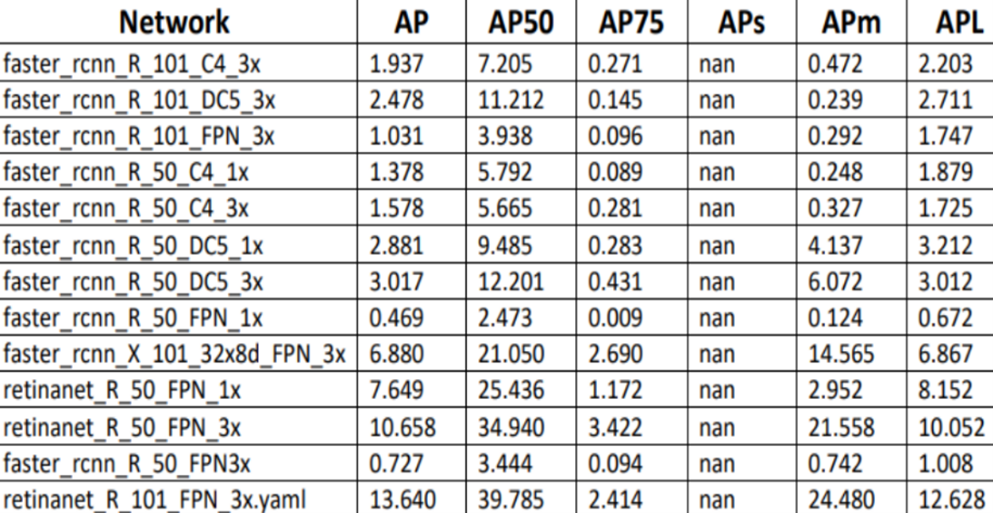
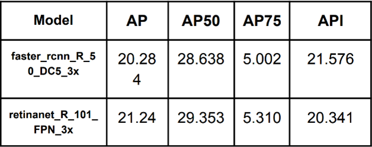
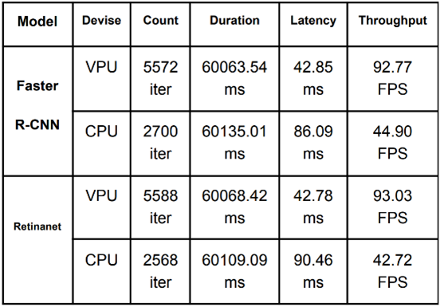

# Object-Detection-Using-Detectron
# 2D object tracking learning and inferencing using Detectron2 

Here, we will go through installing detectron2, including the following:
* Run inference on images with an existing detectron2 model
* Train a detectron2 model on a new dataset
*  evaluation 

You can make a copy of this project by "File -> Open in playground mode" and make changes there. __DO NOT__ request access to this project.
We first test an image from the our dataset:
Then, we create a detectron2 config and a detectron2 `DefaultPredictor` to run inference on this image.
<h1>Part one</h1>
# Train on our dataset (custom)
  
In this section, we show how to train an existing detectron2 model on a our dataset in a new format.
our dataset only has one class: Person.

#Register the our dataset to detectron2
## Train!
Now, let's fine-tune a COCO-pretrained all Zoo-model on our  dataset. It takes ~6 minutes to train 300 iterations on Colab's K80 GPU, or ~2 minutes on a P100 GPU.
Then
## Inference & evaluation using our trained model
Now, let's run inference with the trained model on the our validation dataset. First, we create a predictor using the model we just trained:
   
# We will evaluate the performance using AP metric implemented in COCO API.
Inference & Evaluation on First Dataset
We used Google Collab to work with Detectron2, after the successful installation, we used the transfer learning pre-trained approach, it's provided by Detectron2 and we used it in training our dataset.
   
The measure that we used is AP (Average Precision) in order to compare the results for each model.

From the results, we find that the best performance (for the dataset that we have) is:
1) retinanet_R_101_FPN_3x
2) faster_rcnn_X_101_32x8d_FPN_3x
  
They got the highest results therefore we used them for the second dataset.
   
<h1>Part two</h1>

Now for the Second Dataset, we used the Visdrone data http://aiskyeye.com/download/multi-object-tracking_2021/
For Inference and Evaluation on Second Dataset, we used the previous models and the results were.

  
From the previous results, it can be said that for visdrone dataset, we find that using the retinanet model is better than the faster-rcnn model.
we compared the performance of previous models between NCS2 VPU and CPU.
We used OpenVINO for NCS2.
The steps for preparing models for comparison were as follows:
1) At first the models must be converted from PyTorch to ONNX and the output from this process is a file with extension .onnx
2) Convert the previous output from onnx to the openvino pattern which is called IR.
3) in order to compare the models on both the CPU & VPU, we used Benchmark Python. 
 

 
The results clearly show that the second model Retinanet gives more promising results than the Faster R-CNN model on the Visdrone dataset.
Deploying a model on a VPU is stronger and faster than deploying on a CPU and it is preferred to use because when we used the VPU on the second model the Latency was 42.78 ms which is lower than the Latency when we used CPU 90.46 ms and the Throughput was on vpu 93.03 FPS but on CPU 42.74 therefore, it is preferable to use the VPU as hardware.
You can check out the article here Comparative Study: 2D object Detection & inferencing using Detectron2

  
  
